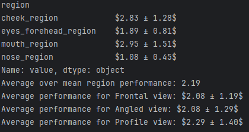

© [2025] Ubisoft Entertainment. All Rights Reserved

## MultiREX Benchmark

This GitHub repository hosts the **MultiREX** benchmark, a new video-based face expression capture benchmark based on the [Multiface](https://github.com/facebookresearch/multiface) dataset. For more details, see our [Project Page](https://ubisoft-laforge.github.io/character/serep/) and [Paper](https://arxiv.org/abs/2412.14371).

MultiREX includes 8 identities captured simultaneously from five viewpoints selected from [Multiface](https://github.com/facebookresearch/multiface): Frontal, two Angled views (yaw rotation around 40 degrees), and two Profile views (yaw rotation around 60 degrees).  
Each subject performs a range-of-motion sequence covering a wide range of expressions, including extreme and asymmetrical motions.  
The benchmark comprises 10k ground truth meshes and 49k images.

We obtained the ground truth identity (i.e., neutral mesh) by manually selecting a neutral frame for each subject and retopologizing the corresponding mesh to the 
[FLAME](https://flame.is.tue.mpg.de) topology using the [Wrap 3D](https://faceform.com/) commercial software.
From these two meshes, we compute a per-subject sparse conversion matrix that enables fast conversion from the FLAME to the Multiface topology. **We will soon provide additional information for anyone interested in integrating new topologies into the MultiREX benchmark.**

We adopt a region-based evaluation method, dividing the face into four regions and performing region-based rigid alignment before assessment. 
This avoids penalizing a model due to rigid misalignment between the predicted and GT meshes, and instead focuses on the non-rigid deformations. 
The regions we evaluate are the forehead, cheek, mouth, and nose. For each region, we find the optimal rigid alignment between the GT and predicted meshes in the Multiface topology and compute the per-vertex error.

## Contents

- [Installation](#installation)
- [Evaluation using MultiREX](#evaluation-using-multirex)
  - [1. Prepare evaluation](#1-prepare-evaluation)
  - [2. Benchmark evaluation](#2-benchmark-evaluation)
- [Extending benchmark to new topologies](#extending-benchmark-to-new-topologies)
- [Citation](#citation)
- [License](#license)

<!-- 2. [Repository details](#repository-details) -->

# Installation

The benchmark is built on the [Multiface](https://github.com/facebookresearch/multiface) dataset and requires ~15 GB of storage.  

1. Please start by cloning this repository and install dependencies. 

```bash
cd MULTIREX
sh multirex_conda.sh
```

2. Download the benchmark videos and tracked meshes (this may take ~24h for the full benchmark) using the following command:

```bash
python -m multirex.scripts.download_videos_and_tracked_meshes --base_installation_folder "./" --download_config "./assets/download_config.json"
```

`./assets/download_config.json` is parametrized to download only MultiREX data. The `--cameras` argument can be changed to download specific camera views but is set by default to download the ones used in our benchmark.  

3. Once step 2 complete, get the ground truth numpy sequences out of per frame .bin files (for later evaluation) using the following command:

```bash
python -m multirex.scripts.get_gt_npy_sequences --base_installation_folder "./" --output_multiface_gt_path "./assets/multiface_gt"
```

4. Download the FLAME model from [here](https://flame.is.tue.mpg.de/index.html) and move `generic_model.pkl` (FLAME2020) file to `./assets/FLAME`. You will need to sign up and agree to the model license for access.

# Evaluation using MultiREX

We outline the steps required to prepare and evaluate your face expression capture approach on MultiREX.

Please ensure you have the **39 benchmark videos** (by default in `./videos_gamma_corrected`) after completing the [installation](#installation).

## 1. Prepare evaluation

1. **Detector.** To **avoid detection issues** and ensure a **fair comparison**, we provide **precomputed bounding boxes** as NumPy arrays for each benchmark frame.

   Bounding boxes have been obtained by projecting ground-truth 3D facial keypoints onto each camera view and computing the minimum and maximum `(x, y)` coordinates.

   The file `./assets/video_bbox_mapping.pickle` contains a mapping from video names to the corresponding bounding box sequence, stored as a NumPy array of shape `(nb_frames, 4)`, where each bounding box is formatted as `[x_min, y_min, x_max, y_max]`.

   <details><summary> Example: Retrieving video bounding box sequence </summary>

      ```python
      import pickle
      
      with open("./assets/video_bbox_mapping.pickle", "rb") as f:
          video_bbox_mapping = pickle.load(f)
      
      video_name = "m--20180510--0000--5372021--GHS#images#EXP_ROM07_Facial_Expressions#400039.mp4"
      
      bbox_sequence = video_bbox_mapping[video_name]
      ```
   </details>

2. **Expression capture.** When processing benchmark videos with your approach, save the full sequence of FLAME animation parameters in a `.pkl` or `.npz` file named after the video (for video "video_name.mp4", the output file should be named "video_name.pkl" or "video_name.npz"). Store the 39 files in a folder, e.g., `./path/to/flame/components/capture`. The dictionary structure should be as follows:

    ```python
   flame_params = {
         "expressions": expression_params,  # expression parameters of shape (nb_frames, nb_exp_components)
         "poses": pose_params,  # pose parameters of shape (nb_frames, 6) - the 6 pose components are the 3 neck parameters followed by the 3 jaw parameters.
   }
   ```
   *Notes:*
   - *We do not use shape parameters, as we provide neutral GT meshes and evaluate expression deformation only.*  
   - *Optionally, eyelid parameters can be included in the `flame_params` dictionary using the `eyelids` key.*

## 2. Benchmark evaluation

Once the 39 videos have been processed with your face expression capture approach, launch the benchmark evaluation using the following command:

```bash
python -m multirex.multirex_evaluation.py --input_folder "/path/to/flame/components/capture" --output_folder "/path/to/results" --n_exp_components 100 --gt_path "./assets/multiface_gt"
```
with:
- `--input_folder`: Path to the folder containing the FLAME parameter `.pkl` or `.npz` files for each video.
- `--output_folder`: Path to the folder where the results will be saved.
- `--n_exp_components`: Number of FLAME expression components used for evaluation. By default, we use 100 components.
- `--gt_path`: Path to the ground truth numpy sequences in the Multiface topology and space. The default download location is `./assets/multiface_gt` after installation step 3.
- `--assets_path`: Path to the folder containing the assets. By default, this is set to `./assets`.

Optionally, you can also specify:
- `--metrics_from_csv_only`: If set, directly reads the metrics from the CSV file and does not recompute them. This is useful for quick checks after running the evaluation once.
- `--save_multiface`: If set, saves the generated meshes in Multiface topology in the output folder.
- `--save_rigid`: If set, saves the rigidly aligned Multiface topology meshes in the output folder.

**Once processed, metrics are saved in a CSV file and displayed on screen.**

<details><summary> Example results: </summary>

</details>

# Extending benchmark to new topologies

Will be added soon.

<!-- We provide the necessary information for anyone to contribute and add new topologies to MultiREX. 
Currently, MultiREX supports the FLAME topology only.
For evaluation, one must compute conversion matrices allowing to convert a source identity in topology A (new topology) to a target identity in topology B (Multiface topology). A distinct matrix must be computed once for each of the 8 identity. We encourage you to use following workflow.

1. Select a generic face from your topology. 
2. Install [WRAP 3D](https://faceform.com/download-wrap/) commercial software to follow our workflow. It is free for students, teachers, and schools. We use this software for alignment and retopo.
3. Within WRAP 3D, follow the steps bellow for each of the 8 identities: 
   - Load the generic face from your topology (LoadGeom node).
   - Load the neutral in multiface topology from `./assets/Neutrals_Multiface` (LoadGeom node).
   - Scale the generic face to match the size of the Multiface neutral (directly in the LoadGeom node), which is in metric space.
   - Align the generic face to the Multiface topology by selecting keypoints for rigid alignment (SelectPointPairs + RigidAlignment nodes).
   - Select a set of (new) keypoints for the generic face to match the Multiface topology (SelectPointPairs node).
   - Convert topology to the Multiface topology by retopologizing the generic face to the Multiface topology (Wrapping node).
   - Save the aligned and retopologized face (SaveGeom node).

4. Compute conversion matrix, which allows to move from your source topology to the Multiface topology by simple matrix multiplication for any new mesh.

   ```bash
   python -m scripts.compute_conversion_matrices --target_topo /path/to/multiface/neutral --source_topo /path/to/your/neutral --output /path/to/output.npz --output_metadata /path/to/output_metadata.pkl
   ```
--> 

# Citation

If you use MultiREX, please cite [our paper](https://arxiv.org/abs/2412.14371) and the [Multiface technical report](https://arxiv.org/abs/2207.11243):

```
@article{josi2024serep,
  title={SEREP: Semantic Facial Expression Representation for Robust In-the-Wild Capture and Retargeting},
  author={Josi, Arthur and Hafemann, Luiz Gustavo and Dib, Abdallah and Got, Emeline and Cruz, Rafael MO and Carbonneau, Marc-Andre},
  journal={arXiv preprint arXiv:2412.14371},
  year={2024}
}

@inproceedings{wuu2022multiface,
  title={Multiface: A Dataset for Neural Face Rendering},
  author = {Wuu, Cheng-hsin and Zheng, Ningyuan and Ardisson, Scott and Bali, Rohan and Belko, Danielle and Brockmeyer, Eric and Evans, Lucas and Godisart, Timothy and Ha, Hyowon and Huang, Xuhua and Hypes, Alexander and Koska, Taylor and Krenn, Steven and Lombardi, Stephen and Luo, Xiaomin and McPhail, Kevyn and Millerschoen, Laura and Perdoch, Michal and Pitts, Mark and Richard, Alexander and Saragih, Jason and Saragih, Junko and Shiratori, Takaaki and Simon, Tomas and Stewart, Matt and Trimble, Autumn and Weng, Xinshuo and Whitewolf, David and Wu, Chenglei and Yu, Shoou-I and Sheikh, Yaser},
  booktitle={arXiv},
  year={2022},
  doi = {10.48550/ARXIV.2207.11243},
  url = {https://arxiv.org/abs/2207.11243}
}
```

# License

MULTIREX is CC-BY-NC 4.0 licensed and can only be used for research purpose. Details are provided in the license.txt file.

© [2025] Ubisoft Entertainment. All Rights Reserved
